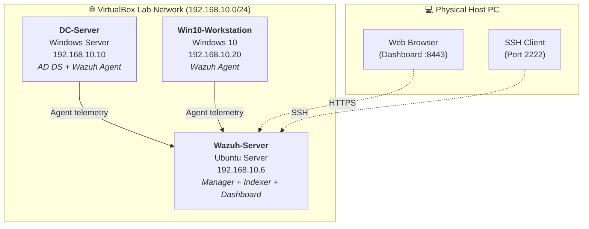

# Active Directory & Wazuh SIEM Home Lab 🛡️

## 📌 Overview

This project demonstrates a **home lab environment integrating Active Directory with Wazuh SIEM** for centralized log collection, real-time monitoring, and security event analysis.

The lab includes:

* **Active Directory Domain Services (AD DS)**
* **Windows audit policy hardening with GPO**
* **Wazuh SIEM deployment**
* **Custom detection rules mapped to MITRE ATT&CK**
* **Simulated credential attacks and log tampering scenarios**

---

## 🏗️ Architecture



---

## ⚙️ Lab Components

| Component             | Role                                | IP Address      |
| --------------------- | ----------------------------------- | --------------- |
| **DC-Server**         | Windows Server / Domain Controller  | `192.168.10.10` |
| **Win10-Workstation** | Domain-joined endpoint              | `192.168.10.20` |
| **Wazuh-Server**      | Wazuh Manager + Indexer + Dashboard | `192.168.10.6`  |

---

## 🚀 Features Implemented

### 🔐 Active Directory Domain Services

* Created the **`ad.lab.local`** domain
* Configured **Organizational Units (OUs)**
* Created **domain users and groups**
* Joined Windows 10 workstation to the domain

### 📋 Advanced Audit Policies (GPO)

Enabled detailed Windows auditing for:

* **Process Creation** (`Event ID 4688`)
* **Failed Logons** (`Event ID 4625`)
* **Successful Logons** (`Event ID 4624`)
* **Event Log Clearing / Tampering** (`Event ID 1102`, `104`)

### 📡 Wazuh SIEM Integration

* Installed **Wazuh agents** on both Windows hosts
* Verified **telemetry ingestion** to the Wazuh Manager
* Confirmed event visibility in the **Wazuh Dashboard**

### 🛠️ Custom Detection Rules

Created custom rules in **`local_rules.xml`** to detect **Windows Event Log clearing** and elevate the alert to **Critical severity**.

**MITRE ATT&CK mapping:**

* **T1070 – Indicator Removal on Host**

Example rule:

```xml
<group name="windows,attack,t1070,">
  <rule id="100110" level="15">
    <if_group>windows</if_group>
    <field name="win.system.eventID">1102|104</field>
    <description>Critical: Windows event logs were cleared</description>
    <mitre>
      <id>T1070</id>
    </mitre>
  </rule>
</group>
```

---

## 🎯 Simulated Attack Scenarios

### 1️⃣ Authentication Failures / Brute Force

**Technique:** Password spraying against domain accounts using PowerShell.

**Observed events:**

* `4625` – Failed logon attempts
* Multiple failures correlated into **High severity Wazuh alerts**

**Detection outcome:**

* Real-time alert generation
* Source host identification
* Logon type and target account visibility

---

### 2️⃣ Defense Evasion – Log Clearing
* **Technique:** Clearing Windows Event Logs on the workstation and domain controller.
* **Commands used:**
```powershell
Clear-EventLog -LogName Security
Clear-EventLog -LogName System
```


**Observed events:**

* `1102` – The audit log was cleared
* `104` – The log file was cleared

**Detection outcome:**

* **Critical (Level 15)** alert triggered immediately
* Alert visible in the **Wazuh Dashboard**
* MITRE ATT&CK **T1070** tagging confirmed

---

## 📊 Security Monitoring Workflow

1. **Windows host generates security event**
2. **Wazuh Agent collects telemetry**
3. **Wazuh Manager decodes and analyzes logs**
4. **Custom rules apply severity and MITRE mapping**
5. **Alert is indexed and displayed in the dashboard**

---

## 🧪 Validation Results

| Scenario          | Event IDs     | Wazuh Severity | Status     |
| ----------------- | ------------- | -------------- | ---------- |
| Failed logon      | `4625`        | High           | ✅ Detected |
| Successful logon  | `4624`        | Informational  | ✅ Detected |
| Process creation  | `4688`        | Medium         | ✅ Detected |
| Event log cleared | `1102`, `104` | Critical       | ✅ Detected |

---

## 🖥️ Example Dashboard Alert

```text
Rule: 100110
Level: 15 (Critical)
Technique: T1070 - Indicator Removal on Host
Host: WIN10-WORKSTATION
Event ID: 1102
Description: Windows event logs were cleared
```

---

## 📂 Repository Structure

```text
ActiveDirectory-Wazuh-Lab/
├── README.md
├── screenshots/
│   ├── wazuh-dashboard.png
│   ├── brute-force-alert.png
│   └── log-clearing-alert.png
├── configs/
│   ├── local_rules.xml
│   └── agent.conf
└── docs/
    ├── architecture.md
    └── attack-scenarios.md
```

---

## 🧰 Technologies Used

* **Windows Server 2022**
* **Windows 10**
* **Active Directory Domain Services**
* **Group Policy Management**
* **Wazuh 4.x**
* **Ubuntu Server 24.04**
* **VirtualBox**
* **PowerShell**

---

## 📚 Learning Outcomes

Through this project I gained hands-on experience with:

* Active Directory administration
* Windows security auditing
* SIEM deployment and management
* Log analysis and event correlation
* Custom Wazuh rule development
* MITRE ATT&CK mapping and threat detection
* Simulating real-world attack techniques in a controlled lab environment

---

## 🔮 Future Improvements

* Add **Sysmon** for enhanced process and network telemetry
* Integrate **Sigma rules** with Wazuh
* Forward logs to an additional **Elastic Stack** instance
* Simulate **Kerberoasting** and **Pass-the-Hash** attacks
* Add **email / Discord / Slack alerting** for critical events


---

## 👤 Author

**Mateusz Bennek**

* 🎓 Cybersecurity Student
* 🛡️ Junior System / Network Administration Enthusiast
* ☁️ Interested in **Linux, Networking, Active Directory, Sec technologies**
